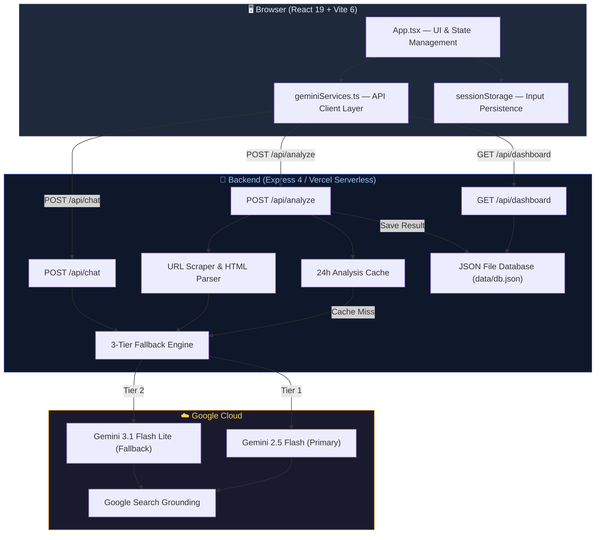

<div align="center">


# Factscope-AI

### *Enterprise-Grade AI News Credibility & Claim Verification Desktop Application & Engine*

[](https://opensource.org/licenses/Apache-2.0)
[](https://react.dev)
[](https://vitejs.dev)
[](https://tailwindcss.com)
[](https://expressjs.com)
[](https://www.typescriptlang.org)
[](https://www.electronjs.org)
[](https://www.electron.build)
[](https://ai.google.dev)
[](https://ai.google.dev)
[](https://ai.google.dev/gemini-api/docs/google-search)
[](https://vercel.com)


</div>

---

## 📖 Table of Contents

1.  [🧩 The Problem & The Solution](#-the-problem--the-solution)
2.  [✨ Features Overview](#-features-overview)
3.  [🏛️ System Architecture](#️-system-architecture)
4.  [🤖 3-Tier AI Fallback Engine](#-3-tier-ai-fallback-engine)
5.  [⚙️ Tech Stack & Infrastructure](#️-tech-stack--infrastructure)
6.  [📂 Directory Structure](#-directory-structure)
7.  [🔒 Security-First Design](#-security-first-design)
8.  [🔌 API Specifications](#-api-specifications)
9.  [🚀 Getting Started & Local Setup](#-getting-started--local-setup)
10. [🌐 Production Deployment](#-production-deployment)
11. [🎯 Who Is This For?](#-who-is-this-for)
12. [📝 License](#-license)

---

## 🧩 The Problem & The Solution

### The Problem

In the modern digital landscape, the rapid spread of misinformation, deceptive headlines, and manipulated content represents a critical threat to information integrity. The challenges are multi-layered:

- **Scale**: Millions of news articles, social media posts, and viral claims are published every hour. Manual fact-checking simply cannot keep pace.
- **Speed**: Misinformation spreads 6x faster than accurate news on social platforms. By the time a fact-checker publishes a correction, the damage is already done.
- **AI Hallucinations**: Standard Large Language Models (LLMs) suffer from knowledge cutoff constraints and tend to "hallucinate" — generating plausible-sounding but fabricated answers — making them unreliable for verifying real-time events without external grounding.
- **Cost & Complexity**: Building a reliable verification pipeline from scratch requires integrating AI models, search APIs, web scraping, caching layers, and secure key management — a significant engineering investment.

### The Solution

**Factscope-AI** is a secure, full-stack, real-time AI-powered news analysis and credibility verification platform. It combines **Google's Gemini 2.5 Flash** model with **Google Search Grounding** to automatically decompose content into individual claims and cross-verify each one against live, high-authority web resources — producing a structured, auditable credibility report in seconds.

Unlike simple chatbot wrappers, Factscope-AI provides:
- **Structured, machine-readable output** with per-claim verdicts, confidence scores, and source citations.
- **A full verification pipeline** including URL scraping, claim extraction, web-grounded verification, caching, and persistent analytics.
- **A production-ready architecture** with a secure backend that never exposes API keys to the browser.

---

## ✨ Features Overview

### 🔍 Core Analysis Engine

| Feature | Description |
|---|---|
| **Structured Claim Deconstruction** | Automatically breaks down large news articles or snippets into 2–4 individual, checkable factual claims. |
| **Real-Time Web Grounding** | Each claim is verified against live Google Search results, grounding the AI's reasoning in real, up-to-date sources — not memorized training data. |
| **Multi-Label Credibility Verdicts** | Content is classified into one of five actionable labels: `REAL`, `FAKE`, `MISLEADING`, `SATIRE`, or `UNVERIFIED`. |
| **Granular Per-Claim Verdicts** | Each extracted claim receives its own individual verdict: `TRUE`, `FALSE`, `CONTEXT_NEEDED`, or `UNPROVEN` — with a specific justification and a direct source citation link. |
| **Confidence Scoring** | A numeric confidence score (0–100%) accompanies every analysis, visually rendered as an animated circular gauge. |
| **AI Reasoning Transparency** | A detailed explanation section provides the AI's reasoning behind the overall credibility label, making the analysis auditable and understandable. |

### 🌐 URL Scraping & Direct Analysis

| Feature | Description |
|---|---|
| **Direct URL Analysis** | Users can paste a URL to any news article. The backend fetches the page, strips HTML/CSS/JS/SVG, extracts clean text content, and feeds it through the same verification pipeline. |
| **Smart HTML Extraction** | A custom-built server-side HTML parser strips `<script>`, `<style>`, `<svg>`, and comments; converts block elements to line breaks; decodes HTML entities; and produces clean plaintext — all without a headless browser dependency. |
| **Dual Input Modes** | A toggle switch in the sidebar lets users seamlessly switch between `Text` mode (paste raw content) and `URL` mode (paste a link). |

### 💬 Contextual Follow-Up Chat

| Feature | Description |
|---|---|
| **Post-Analysis Q&A** | After any analysis completes, users can ask follow-up questions directly within a contextual chat interface — e.g., *"How was the confidence score determined?"*, *"Are there counter-claims?"*, or *"Explain claim #2 in more detail."* |
| **Full Report Context Injection** | The chat system prompt includes the complete analysis report (original input, label, confidence, claims, sources, explanation), so the AI always answers within the context of the specific verification. |
| **Rich Markdown Rendering** | Chat responses are rendered with a custom Markdown parser supporting headings, **bold**, *italic*, `inline code`, fenced code blocks, numbered/bullet lists, blockquotes, horizontal rules, and clickable links. |
| **Live Source Citations** | Chat responses include dynamically extracted Google Search grounding sources displayed as clickable citation links below the conversation. |
| **Multi-Turn Conversation** | Full conversation history is maintained and passed to the Gemini API, enabling coherent multi-turn dialogue with context awareness. |
| **Optimistic UI Updates** | User messages appear instantly in the chat while the AI response loads; if an error occurs, the message is rolled back automatically. |

### 📊 Global Analytics Dashboard

| Feature | Description |
|---|---|
| **Persistent Database** | All analysis results are saved to a local JSON database (`data/db.json`), building a historical record of all verified content. |
| **Total Checks Counter** | Displays the total number of analyses ever performed across all sessions. |
| **Average Confidence Score** | Shows the aggregate average confidence score across all historical analyses. |
| **Verdict Distribution Chart** | An animated bar chart breaks down the percentage distribution across all five verdict labels (`REAL`, `FAKE`, `MISLEADING`, `SATIRE`, `UNVERIFIED`). |
| **Debunked Claims Feed** | Surfaces up to 5 unique `FALSE`-verdict claims from historical analyses, each with its reason and verification source link — forming a mini fact-check database. |
| **Recent Records Browser** | Displays the 10 most recent analysis records with clickable cards that reload the full report when clicked. |

### ⚡ Performance & Resilience

| Feature | Description |
|---|---|
| **3-Tier AI Fallback Engine** | Automatic model degradation: `Gemini 2.5 Flash` → `Gemini 3.1 Flash Lite` → `Gemini 3.1 Flash Lite (Searchless)`. Ensures the system never fully fails due to quota exhaustion. *(See detailed section below.)* |
| **24-Hour Intelligent Caching** | Duplicate inputs are automatically served from cache (keyed by normalized input + URL flag, TTL: 24 hours), eliminating redundant API charges and reducing latency. |
| **Request Abort & Deduplication** | Submitting a new analysis while one is in-flight automatically aborts the previous request via `AbortController`, preventing race conditions. |
| **90-Second Client Timeout** | A client-side timeout guard prevents indefinite hanging if the AI service is unresponsive, with a clear user-facing error message. |
| **Session Persistence** | User input and input mode are persisted to `sessionStorage`. If the browser tab reloads mid-analysis, the input is preserved and a recovery message prompts the user to re-submit. |
| **Backend Health Check** | On page load, the frontend pings `/api/dashboard` to determine if the backend is online, displaying a real-time status indicator (`API Online` / `API Offline`) in the header. |

### 🎨 User Experience

| Feature | Description |
|---|---|
| **Dark Mode UI** | A premium, slate-based dark theme designed for extended reading with high contrast and zero eye strain. |
| **GPU-Accelerated Animations** | Smooth page transitions, loading states, result reveals, and confidence gauge animations powered by the [Motion](https://motion.dev/) library. |
| **Animated Loading Sequence** | A rotating message sequence (*"Scanning content with AI..."*, *"Extracting key claims..."*, *"Verifying claims with Google Search..."*, *"Generating credibility report..."*) keeps users informed during analysis. |
| **One-Click Report Export** | A "Copy Report" button generates a formatted plaintext report (verdict, confidence, summary, claims with verdicts, sources, timestamp) and copies it to the clipboard. |
| **Session History Sidebar** | The last 5 analyses are preserved in a sidebar history panel with labels and timestamps, allowing instant re-access to previous results. |
| **Demo Examples** | Pre-loaded examples of a fake news article and a credible news article let first-time users instantly test the system with one click. |
| **Keyboard Shortcuts** | `Ctrl+Enter` triggers analysis from the text input; `Enter` sends chat messages and triggers URL analysis. |
| **Responsive Error States** | Distinct error states for network failures, server restarts, API timeouts, and validation errors — each with specific recovery guidance. |

### 🖥️ Desktop Application (Electron)

| Feature | Description |
|---|---|
| **Local Settings & API Key Setup** | Obfuscated storage of user's Gemini API key locally on the machine via `electron-store`, avoiding server-side key requirements for desktop users. |
| **First-Launch Onboarding** | Detects empty configuration and guides the user through API key registration before enabling fact-check submissions. |
| **Minimize to System Tray** | The application runs in the background and can minimize to the system tray (`Ctrl+Q` or tray context menu to exit). |
| **Dynamic Port Binding** | Express server starts programmatically on launch inside Electron, dynamically querying and binding to an available port. |
| **Native Application Menu** | Desktop-friendly file menus featuring application info, settings shortcuts (`Ctrl+,` or `Cmd+,`), and AI studio links. |
| **Secure Link Redirection** | Intercepts external navigation attempts and redirects links to open in the user's default system browser. |
| **GPU Optimization Flags** | Tailored flags disable GPU caches and hardware acceleration in Windows environments to prevent "Access is denied" folder locks. |

---

## 🏛️ System Architecture

Factscope-AI operates in two deployment modes:

1. **Web Deployment Mode**: Uses a decoupled client-server architecture. The React frontend is deployed to a host like Vercel or Netlify and communicates with the backend REST endpoints (`/api/*`), keeping AI API keys secure in serverless environment variables.
2. **Desktop Application Mode**: Runs in a self-contained Electron environment. On startup, the Electron main process runs an embedded Express server on a dynamically resolved port. It reads the local config (API key) stored securely in `electron-store`, injects it into the environment of the server, and loads the frontend. Inter-process communication (IPC) bridges settings changes between React and the Electron shell.

Regardless of the mode, the frontend is a pure consumer of the backend REST API — it never exposes credentials or interacts with AI APIs directly.



### Request Flow (Analysis)

```mermaid
sequenceDiagram
    autonumber
    actor User as User Browser
    participant FE as React Frontend (Vite)
    participant BE as Express Backend / Vercel Serverless
    participant Cache as 24h Analysis Cache
    participant Scraper as URL Scraper
    participant AI as 3-Tier Fallback Engine
    participant Gemini as Gemini API + Google Search

    User->>FE: Paste content or URL → Click "Analyze Now"
    Note over FE: Validate input (≥50 chars or valid URL)
    FE->>BE: POST /api/analyze { input, isUrl }

    BE->>Cache: Check for cached result (normalized input, ≤24h)
    alt Cache Hit
        Cache-->>BE: Return cached AnalysisResult
        BE-->>FE: HTTP 200 (cached)
    else Cache Miss
        alt isUrl = true
            BE->>Scraper: Fetch & parse HTML → clean text
            Scraper-->>BE: Title + extracted text
        end
        BE->>AI: generateWithFallback(prompt, config)
        
        rect rgb(30, 41, 59)
            Note over AI: Tier 1: Gemini 2.5 Flash + Search
            AI->>Gemini: generateContent()
            Gemini-->>AI: JSON response
            Note over AI: If 429/quota error → Tier 2: Gemini 3.1 Flash Lite + Search
            Note over AI: If 429/quota error → Tier 3: Gemini 3.1 Flash Lite (Searchless)
        end

        AI-->>BE: Raw AI text response
        Note over BE: Parse JSON, attach UUID + timestamp + snippet
        BE->>Cache: Save to database (data/db.json)
        BE-->>FE: HTTP 200 { id, label, confidence, claims, sources, ... }
    end

    FE->>User: Animate verdict, confidence gauge, claims cards, sources
```



---

## 🤖 3-Tier AI Fallback Engine

A defining architectural feature of Factscope-AI is its **automatic 3-tier model degradation strategy**. This ensures the system remains operational even when primary model quotas are exhausted — a common scenario during high usage or on free API tiers.

```
┌─────────────────────────────────────────────────────────────────────┐
│                       INCOMING REQUEST                              │
└────────────────────────────┬────────────────────────────────────────┘
                             │
                             ▼
              ┌──────────────────────────┐
              │   TIER 1 (Primary)       │
              │   Gemini 2.5 Flash       │
              │   + Google Search        │
              │   Grounding              │
              └──────────┬───────────────┘
                         │
                    Success? ──── Yes ───→ Return Response
                         │
                        No (429 / Quota)
                         │
                         ▼
              ┌──────────────────────────┐
              │   TIER 2 (Fallback)      │
              │   Gemini 3.1 Flash Lite  │
              │   + Google Search        │
              │   Grounding              │
              └──────────┬───────────────┘
                         │
                    Success? ──── Yes ───→ Return Response
                         │
                        No (429 / Quota)
                         │
                         ▼
              ┌──────────────────────────┐
              │   TIER 3 (Searchless)    │
              │   Gemini 3.1 Flash Lite  │
              │   NO Search Tools        │
              │   (Pre-trained knowledge │
              │    only)                 │
              └──────────┬───────────────┘
                         │
                    Success? ──── Yes ───→ Return Response
                         │
                        No ───→ Throw Error to Client
```

| Tier | Model | Search Grounding | When It Activates |
|------|-------|-----------------|-------------------|
| **Tier 1** | `gemini-2.5-flash` | ✅ Enabled | Default — always tried first |
| **Tier 2** | `gemini-3.1-flash-lite` | ✅ Enabled | When Tier 1 returns HTTP 429 or `RESOURCE_EXHAUSTED` |
| **Tier 3** | `gemini-3.1-flash-lite` | ❌ Disabled | When Tier 2 also hits search tool quota limits |

> **Why Tier 3 exists:** Google Search Grounding has its own separate quota. Even if the model API itself has capacity, the search tool can be rate-limited independently. Tier 3 bypasses search entirely and relies on the model's pre-trained knowledge — a degraded but functional experience.

This fallback logic is implemented in **both** the Express local server (`server/index.ts`) and the Vercel serverless functions (`api/analyze.ts`, `api/chat.ts`), ensuring consistent resilience across all deployment environments.

---

## ⚙️ Tech Stack & Infrastructure

The application is built on a modern, fully-typed TypeScript stack with zero runtime compromises:

### Frontend

| Technology | Version | Purpose |
|---|---|---|
| [React](https://react.dev/) | 19.0 | UI framework — functional components with hooks |
| [Vite](https://vitejs.dev/) | 6.2 | Build tool — HMR, bundling, dev proxy, asset optimization |
| [Tailwind CSS](https://tailwindcss.com/) | 4.1 | Utility-first CSS — slate-based dark mode design system |
| [Motion](https://motion.dev/) | 12.23 | Animation library — GPU-accelerated transitions and reveals |
| [Lucide React](https://lucide.dev/) | 0.546 | Icon library — clean, modern SVG icons |
| [Inter](https://fonts.google.com/specimen/Inter) + [JetBrains Mono](https://fonts.google.com/specimen/JetBrains+Mono) | — | Typography — premium sans-serif + monospace fonts |

### Backend & API

| Technology | Version | Purpose |
|---|---|---|
| [Express](https://expressjs.com/) | 4.21 | HTTP server — local development API routing |
| [Vercel Serverless Functions](https://vercel.com/docs/functions) | — | Production deployment — zero-config serverless hosting |
| [@google/genai SDK](https://www.npmjs.com/package/@google/genai) | 1.29 | Google's official Gemini AI SDK |
| [dotenv](https://www.npmjs.com/package/dotenv) | 17.2 | Environment variable management |
| [TSX](https://github.com/privatenumber/tsx) | 4.21 | TypeScript execution runtime for Node.js |
| [Concurrently](https://www.npmjs.com/package/concurrently) | 9.2 | Parallel process runner for frontend + backend dev servers |

### Language & Build

| Technology | Version | Purpose |
|---|---|---|
| [TypeScript](https://www.typescriptlang.org/) | 5.8 | Static type safety across frontend and backend |
| ES2022 Target | — | Modern JS features — top-level await, private fields |
| ESNext Modules | — | Native ES module system with bundler resolution |

---

## 📂 Directory Structure

```text
Factscope-AI/
├── .env.example              # Template for backend credentials (GEMINI_API_KEY)
├── .gitignore                # Git exclusions (.env files, node_modules, dist)
├── index.html                # SPA entry point — mounts React to #root
├── metadata.json             # Project metadata (name, description, capabilities)
├── package.json              # Dependencies, scripts, configuration
├── tsconfig.json             # TypeScript compiler options (ES2022, React JSX)
├── vite.config.ts            # Vite config — Tailwind plugin, /api proxy, watcher exclusions
├── SECURITY_CHECKLIST.md     # Security architecture guide & deployment safety checklist
│
├── api/                      # ── Vercel Serverless Functions (Production) ──
│   ├── analyze.ts            #    POST /api/analyze — Full analysis pipeline
│   ├── chat.ts               #    POST /api/chat — Contextual follow-up Q&A
│   └── dashboard.ts          #    GET /api/dashboard — Analytics statistics
│
├── server/                   # ── Express Backend (Local Development) ──
│   ├── index.ts              #    Express server with all routes, scraper, fallback engine
│   ├── db.ts                 #    JSON file database layer (CRUD, caching, stats)
│   └── db.json               #    Local database file (auto-generated, git-ignored)
│
├── data/                     # ── Persistent Data ──
│   └── db.json               #    Primary analysis database (watcher-excluded)
│
└── src/                      # ── React Frontend ──
    ├── main.tsx              #    Application bootstrapper — StrictMode + ReactDOM
    ├── App.tsx               #    Primary UI component — all views, state, and layouts
    ├── index.css             #    Global styles — Tailwind directives, fonts, theme
    └── geminiServices.ts     #    API client layer — TypeScript interfaces & fetch wrappers
```

---

## 🔒 Security-First Design

Factscope-AI is built with enterprise security standards, specifically addressing the common pitfalls of client-side AI integration:

### Vulnerability Mitigations

| Vulnerability | Risk | Mitigation |
|---|---|---|
| **Frontend API Key Exposure** | API key visible in browser source/network tab → unauthorized usage & billing | Key exists **only** in server-side `process.env`. Frontend code is completely agnostic of credentials. No `VITE_`, `NEXT_PUBLIC_`, or `REACT_APP_` prefixed variables exist. |
| **Client-Side AI SDK Usage** | Direct browser-to-AI-provider calls expose the full request/response pipeline | The `@google/genai` SDK is imported and instantiated **exclusively** on the server. The frontend communicates only with `/api/*` relative endpoints. |
| **Payload Injection / DoS** | Oversized payloads could exhaust server resources | Express middleware enforces a strict `1MB` JSON body limit. Input length validation requires ≥30 characters (server) / ≥50 characters (client). |
| **Missing Server-Side Validation** | Malformed requests could cause crashes | All endpoints validate payload types, required fields, and URL format before processing. |
| **Data Integrity** | Client-generated IDs could be spoofed | Cryptographic UUID generation (`crypto.randomUUID()`) and timestamping occur exclusively on the server. |
| **CORS Issues** | Cross-origin requests between frontend and backend | Vite's dev proxy routes `/api` calls to the Express backend on port 3001. In production, Vercel handles this natively. |

### Secure Architecture Diagram

```text
┌─────────────────────────────────────────────────────┐
│           Browser / Frontend (Vite + React)         │
│                                                     │
│   ✗ No API keys    ✗ No AI SDK    ✗ No env vars    │
│                                                     │
│   Only: fetch('/api/analyze', { ... })              │
└───────────────────────┬─────────────────────────────┘
                        │
                        │  POST /api/analyze (NO API KEYS IN REQUEST)
                        ▼
┌─────────────────────────────────────────────────────┐
│      Backend Server (Express / Vercel Serverless)   │
│                                                     │
│   ✓ process.env.GEMINI_API_KEY (server-only)       │
│   ✓ Input validation & size limits                  │
│   ✓ Server-side UUID & timestamp generation         │
│   ✓ Structured error handling                       │
└───────────────────────┬─────────────────────────────┘
                        │
                        │  GoogleGenAI SDK (authenticated)
                        ▼
┌─────────────────────────────────────────────────────┐
│         Google Gemini API + Search Grounding        │
└─────────────────────────────────────────────────────┘
```

### Deployment Safety Checklist

Before deploying to production, verify:

- [ ] **No Frontend Env Vars**: Environment variables **DO NOT** start with `VITE_`, `NEXT_PUBLIC_`, or `REACT_APP_`.
- [ ] **Server-Side Secrets**: `GEMINI_API_KEY` is configured exclusively in your hosting provider's backend/serverless environment settings.
- [ ] **No Console Logs**: No `console.log(process.env)` exists in frontend code.
- [ ] **Git Ignore**: `.env` file is listed in `.gitignore` (it is by default).
- [ ] **HTTPS**: Production deployment uses HTTPS (Vercel provides this automatically).

---

## 🔌 API Specifications

### 1. Analysis Endpoint

Performs a full credibility analysis on text content or a URL.

- **Path**: `POST /api/analyze`
- **Content-Type**: `application/json`
- **Body Limit**: `1MB`

#### Request Payload

```json
{
  "input": "BREAKING: Scientists confirm that drinking hot lemon water every morning completely cures type 2 diabetes within 30 days.",
  "isUrl": false
}
```

| Field | Type | Required | Description |
|---|---|---|---|
| `input` | `string` | ✅ | The text content to analyze, or a full URL (when `isUrl` is `true`). |
| `isUrl` | `boolean` | ❌ | Set to `true` to scrape and analyze a URL. Defaults to `false`. |

*Constraints: Text input must be ≥30 characters (server) or ≥50 characters (client). URL must be a valid absolute URL.*

#### Successful Response (200 OK)

```json
{
  "id": "1d86f71d-5367-4d9f-93d3-9fa74c5d57b2",
  "timestamp": "2026-07-04T15:00:00.000Z",
  "content_snippet": "BREAKING: Scientists confirm that drinking hot lemon water...",
  "label": "FAKE",
  "confidence": 97,
  "summary": "This is a false health claim with no scientific backing.",
  "explanation": "No credible study from Harvard Medical School supports this claim. Type 2 diabetes management requires medical treatment, not lemon water. The phrase 'Big pharma is trying to suppress this' is a common misinformation trope.",
  "claims": [
    {
      "claim_text": "Drinking hot lemon water cures type 2 diabetes within 30 days",
      "verdict": "FALSE",
      "reason": "No peer-reviewed study supports this. Harvard Medical School has not published such research.",
      "source_title": "Harvard Health Publishing",
      "source_url": "https://www.health.harvard.edu/"
    },
    {
      "claim_text": "A study from Harvard Medical School involving 50,000 patients showed 100% success rate",
      "verdict": "FALSE",
      "reason": "No such study exists in any medical database. A 100% success rate claim is a red flag.",
      "source_title": "PubMed Central",
      "source_url": "https://pubmed.ncbi.nlm.nih.gov/"
    }
  ],
  "sources": [
    { "title": "Harvard Health Publishing", "uri": "https://www.health.harvard.edu/" },
    { "title": "American Diabetes Association", "uri": "https://diabetes.org/" }
  ]
}
```

#### Response Schema

| Field | Type | Values / Description |
|---|---|---|
| `id` | `string` | Server-generated UUID v4 |
| `timestamp` | `string` | ISO 8601 timestamp |
| `content_snippet` | `string` | Truncated preview of the analyzed content |
| `label` | `string` | `REAL` \| `FAKE` \| `MISLEADING` \| `SATIRE` \| `UNVERIFIED` |
| `confidence` | `number` | 0–100 confidence percentage |
| `summary` | `string` | 1–2 sentence summary |
| `explanation` | `string` | Detailed reasoning (≤100 words) |
| `claims` | `Claim[]` | Array of extracted claims with individual verdicts |
| `claims[].verdict` | `string` | `TRUE` \| `FALSE` \| `UNPROVEN` \| `CONTEXT_NEEDED` |
| `sources` | `Source[]` | Array of grounding sources used in verification |

---

### 2. Chat Endpoint

Sends a follow-up question about a completed analysis, with full conversation history.

- **Path**: `POST /api/chat`
- **Content-Type**: `application/json`

#### Request Payload

```json
{
  "message": "How was the confidence score determined?",
  "history": [
    { "role": "user", "text": "Why is this rated FAKE?" },
    { "role": "model", "text": "The claim lacks any scientific evidence..." }
  ],
  "context": { /* The full AnalysisResult object from /api/analyze */ }
}
```

#### Successful Response (200 OK)

```json
{
  "text": "## Confidence Score Methodology\n\nThe **97% confidence** was determined by...",
  "sources": [
    { "title": "WHO Health Guidelines", "uri": "https://www.who.int/" }
  ]
}
```

---

### 3. Dashboard Endpoint

Returns aggregated statistics from all historical analyses.

- **Path**: `GET /api/dashboard`

#### Successful Response (200 OK)

```json
{
  "totalChecks": 42,
  "verdictCounts": { "REAL": 18, "FAKE": 12, "MISLEADING": 8, "SATIRE": 2, "UNVERIFIED": 2 },
  "averageConfidence": 78.3,
  "recentAnalyses": [ /* Last 10 AnalysisResult records */ ],
  "debunkedClaims": [
    {
      "claim_text": "5G towers cause COVID-19",
      "verdict": "FALSE",
      "reason": "No scientific evidence links 5G to viral infections.",
      "source_url": "https://www.who.int/..."
    }
  ]
}
```

---

## 🚀 Getting Started & Local Setup

### Prerequisites

- [Node.js](https://nodejs.org/) v18.x or above
- NPM (included with Node.js)
- A [Google Gemini API Key](https://aistudio.google.com/apikey) (free tier available)

### Step 1: Clone and Install

```bash
git clone https://github.com/hamza1713/Factscope-AI.git
cd Factscope-AI
npm install
```

### Step 2: Configure Environment

```bash
cp .env.example .env
```

Edit `.env` and add your Gemini API key:

```env
GEMINI_API_KEY=your_actual_gemini_api_key_here
PORT=3001
```

> ⚠️ **Security Note:** Never prefix this variable with `VITE_`. It must remain server-side only.

### Step 3: Run Development Servers

#### For Web App Development:
```bash
npm run dev
```

This starts **both** servers concurrently:

| Server | URL | Description |
|---|---|---|
| **Vite Frontend** | [http://localhost:3000](http://localhost:3000) | React UI with hot-reload |
| **Express Backend** | [http://localhost:3001](http://localhost:3001) | API server with Gemini integration |

The Vite dev proxy automatically routes all `/api/*` requests from port 3000 to port 3001.

#### For Desktop App (Electron) Development:
```bash
npm run electron:dev
```
This runs the React frontend, the Express backend, and then launches the Electron application container, configuring context isolation and preloading settings.

### Step 4: Previewing & Building Electron App

To run or build the desktop app in production-like environments:

*   **Preview Production Mode Locally:**
    ```bash
    npm run electron:preview
    ```
    This bundles React using Vite, compiles the Electron main/preload TypeScript files, and runs the Electron client using the production build of the frontend and Express server.
*   **Compile Electron TypeScript:**
    ```bash
    npm run electron:compile
    ```
    Compiles TypeScript source code in the `electron/` directory.
*   **Package Executable/Installers:**
    ```bash
    npm run electron:build
    ```
    Bundles the frontend, compiles the Electron codebase, and runs `electron-builder` to package native installer binaries. The finished packages are copied into the `release/` directory.

### Available Scripts

| Script | Command | Description |
|---|---|---|
| `npm run dev` | `concurrently ...` | Start both frontend and backend web dev servers |
| `npm run dev:frontend` | `vite --port=3000 ...` | Start only the Vite frontend |
| `npm run dev:server` | `tsx watch server/index.ts ...` | Start only the Express backend (with auto-reload) |
| `npm run build` | `vite build` | Build production frontend bundle |
| `npm run preview` | `vite preview` | Preview the production web build locally |
| `npm run lint` | `tsc --noEmit` | Type-check the entire codebase |
| `npm run clean` | `rm -rf dist` | Remove the build output directory |
| `npm run electron:dev` | `concurrently ...` | Run Web + Server + Electron in dev mode with DevTools |
| `npm run electron:compile` | `tsc -p electron/tsconfig.json ...` | Compile Electron TypeScript files |
| `npm run electron:preview` | `npm run build && ...` | Compile and run Electron in production mode pointing to embedded server |
| `npm run electron:build` | `npm run build && ...` | Build and package the application into desktop executables/installers |

---

## 🌐 Production Deployment

### Option A: Vercel (Recommended — Zero Config)

This codebase is **pre-configured** for Vercel. The `/api` directory is automatically detected and deployed as serverless functions.

1. Push your project to a GitHub, GitLab, or Bitbucket repository.
2. Import the repository in the [Vercel Dashboard](https://vercel.com/new).
3. Navigate to **Settings → Environment Variables** and add:
   - `GEMINI_API_KEY` → your Google Gemini API key
4. Click **Deploy**. Vercel will:
   - Build the React frontend with Vite → static assets served via CDN
   - Mount `api/analyze.ts`, `api/chat.ts`, `api/dashboard.ts` as serverless function routes
   - Handle HTTPS, CORS, and edge routing automatically

### Option B: Netlify

1. Set the build command to `npm run build` and publish directory to `dist`.
2. Move the serverless handlers from `api/` to `netlify/functions/`.
3. Configure `netlify.toml` to redirect `/api/*` to your serverless functions.
4. Add `GEMINI_API_KEY` to Netlify's environment variables dashboard.

### Option C: Docker / Self-Hosted

For self-hosted deployments, run the Express server directly:

```bash
npm run build                    # Build frontend assets
node --loader tsx server/index.ts  # Start Express server
```

Serve the `dist/` directory as static files and route `/api/*` to the Express server.

---

## 🎯 Who Is This For?

Factscope-AI is designed for a wide range of users and organizations combating misinformation:

| Audience | Use Case |
|---|---|
| **Journalists & Newsrooms** | Rapidly verify breaking news claims before publication. Cross-reference sources in seconds instead of hours. |
| **Social Media Managers** | Screen viral posts and user-generated content for credibility before amplifying or responding. |
| **Educators & Researchers** | Teach media literacy by demonstrating how AI-powered fact-checking works. Use the structured output for academic analysis. |
| **Content Moderators** | Integrate the API into content moderation pipelines to flag potentially misleading content at scale. |
| **NGOs & Fact-Checking Orgs** | Use the dashboard analytics to track misinformation trends and build a database of debunked claims. |
| **General Public** | Quickly check suspicious articles, WhatsApp forwards, or social media posts before sharing them further. |
| **Developers & Startups** | Fork and extend the codebase as a foundation for custom fact-checking products. The clean API layer and modular architecture make it easy to integrate. |

---

## 📝 License

This project is licensed under the **Apache License 2.0** — see individual file headers or the [Apache 2.0 License](https://opensource.org/licenses/Apache-2.0) for details.

---

<div align="center">

**Built with ❤️ using Google Gemini AI + Google Search Grounding**

*Factscope-AI — Because truth matters.*

</div>
